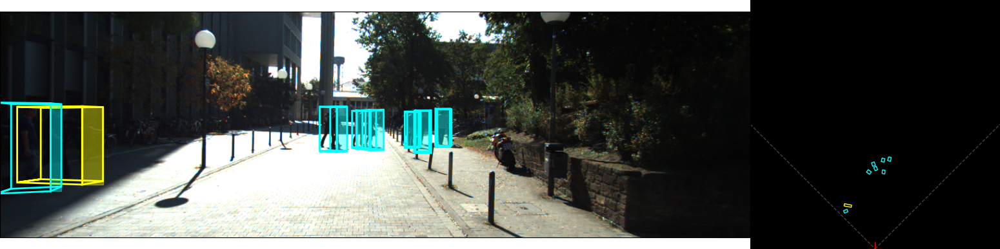
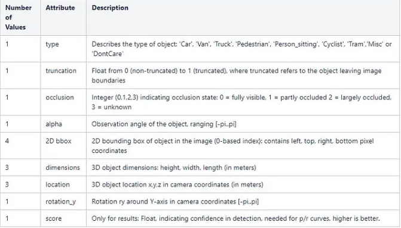
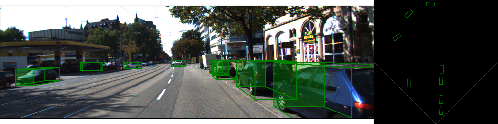
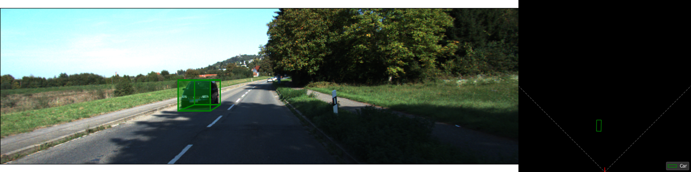

# Automatic Tailgating Detection Pipeline - Network

This repo was constructed for the purpose of automatic tailgating detection via a 3D bounding box network, [SMOKE](https://github.com/lzccccc/SMOKE), the Single-Stage Monocular 3D Object Detection via Keypoint Estimation. The official implementation was slightly altered to accommodate later versions of cuda (cuda 11.8), and allow for inference on the [KITTI dataset](https://www.cvlibs.net/datasets/kitti/). The original paper [SMOKE: Single-Stage Monocular 3D Object Detection via Keypoint Estimation](https://arxiv.org/pdf/2002.10111.pdf) introduces the network and other relevant metrics.

## Introduction

The implementation on this repo is a slightly adjusted version of the original version, with the main focus being visualisation functions and the introduction of automatic tailgating techniques. For the tailgating functions, please refer to the tailgating [README](tailgating_functions/README.md).

The SMOKE network is capable of detecting Cars, Cyclists, and Pedestrians using a monocular input, with 3D bounding boxes being generated. Visualisation functions were adjusted from the [KITTI Object Visualisation Suite](https://github.com/kuixu/kitti_object_vis) to allow for BEV figures, as seen below.





-----------------------------------------------------------------------------

## Requirements
The current implementation was deployed using:

* Ubuntu 20.4
* Python 3.8
* Pytorch 2.2
* CUDA 11.8

The complete conda environment can be copied by using the [environment file](conda_envs/tailgating.yml) and running
the command:

```
conda env create -f tailgating.yml
```

Unlike the original SMOKE, the pytorch version is updated in this implementation. The files used to build the project
have been accordingly altered. However, if you wish to run using a different pytorch version, you can use the [torch download website](https://pytorch.org/get-started/locally/) to help you choose the appropriate command for installation. In the case
of the requirements listed here, the command is shown below. Use this if you come across any issues with the environment.


```
conda install pytorch torchvision torchaudio pytorch-cuda=11.8 -c pytorch -c nvidia
```

-----------------------------------------------------------------------------
## File Setup

The file setup in this project is shown below:

```
Root
│──datasets
│    ├──kitti
└──smoke
     ├──config
     ├──csrc
     └──data
        ...
└──outputs
└──tailgating_functions
└──tools
      ├──logs
            ├──inference
                  ├──kitti_test
                        ├──data
                              ├──Testing_results.txt
└──utils
└──weights
      ├──Weight_file.pth
```  

One point to make is that when running evaluation (i.e. predicting car locations), the results will be stored under
the "data" folder in "tools". The inferences are in the form of KITTI labels, with one txt file per image. The structure
of the labels is as follows:

```
<object_type> <truncation> <occlusion> <alpha> <left> <top> <right> <bottom> <height> <width> <length> <x> <y> <z> <rotation_y>
```

An explanation of the labels is shown in the table below. A detailed analysis of the KITTI labels, along with coordinate frames
used for localisation can be found in [Source 1](https://medium.com/@abdulhaq.ah/explain-label-file-of-kitti-dataset-738528de36f4), [Source 2](https://towardsdatascience.com/kitti-coordinate-transformations-125094cd42fb).



Also note, if you want to run inference directly, you can download the weights (.pth file) and place the file in the "weights" directory. Having established this, some explanation is needed regarding the dataset.


### Dataset Structure

The dataset is taken from KITTI, but a download link will be made available below in order to copy and paste the exact data
structure in your local repository. Firstly, the dataset placed in the datasets folder **must** be called "kitti", as it is
hardcoded this way by the authors. It needs a training and testing directory, and the names of the subfolders need to be the
same as seen below

```
kitti
│──training
│    ├──calib
│    ├──label_2
│    ├──image_2
│    └──ImageSets
└──testing
     ├──calib
     ├──image_2
     └──ImageSets
```  

Note, the ImageSets directory contains txt files that describe which files must be used for training and testing. If you want to e.g. test
the network on a few images, go into /testing/ImageSets/test.txt and only include the names of the images you want to test.
Again, you can download the exact dataset below and should be able to run the code without any changes. Also note, the
testing dataset includes 7518 images. A link has been set up to download the predictions for each image produced using this
network. Finally, a link to some BEV images (explanation later in this README) have been produced for the first 600 images of the testing dataset, but you can produce those locally as well.

-----------------------------------------------------------------------------
## Download Links

* [Link to weights (.pth file)](https://we.tl/t-yHCbOhWDx3)
* [Link to dataset](https://imperiallondon-my.sharepoint.com/:f:/g/personal/ss8413_ic_ac_uk/EvaJtv7LLyVIuYQcsZwZIckBK8NmTgDbMEsFF1J4BQHdog?e=P1k9ui) (Email me if you cannot access)
* [Link to BEV images](https://we.tl/t-kksWzqmSkx)
* [Link to inferences](https://we.tl/t-B4y6aSZYlg)

(Links created via wetransfer on 25 April 2024 and expire after a month. Please email spyros.souipas@outlook.com if you need the links past expiration date.)
-----------------------------------------------------------------------------
## Setup
1. Clone this repository:
```
git clone https://github.com/SpyrosSou/automatic_tailgating
```

2. Create the conda env:
```
cd /path/to/repo/conda_envs
conda env create -f tailgating.yml
conda activate tailgating
```

3. Build the project:
```
cd /path/to/repo
python setup.py build develop
```

4. Copy the downloaded dataset in datasets/kitti directory. Optionally, you can create a link to where you have the
"kitti" folder (downloaded using the above links):
```
cd /path/to/repo/datasets
ln -s /path/to/downloaded/kitti datasets/kitti
```

-----------------------------------------------------------------------------
## Getting Started

First check the config file under `configs/`. You can tune the parameters of training/test. **Note**, this is also where you
should change the path to the .pth file if you want to run evaluation.


For single GPU training, simply run:
```
python tools/plain_train_net.py --config-file "configs/smoke_gn_vector.yaml"
```

For GPU testing:
```
python tools/plain_train_net.py --eval-only --config-file "configs/smoke_gn_vector.yaml"
```

As mentioned, testing will generate txt files under "/path/to/repo/tools/logs/inference/kitti_test/data". These
files will then be used to generate BEV images, as well as tailgating analysis.

-----------------------------------------------------------------------------
## Visualisations

After testing the network and generating the txt files, you can visualise the results. To do so, run:

```
cd utils
python visualization3Dbox.py --labels False --save True --dataset testing --path /output/images/path
```

You can edit the default flags in lines 346-353 of the code. In addition, you can specify the range of images you want
to generate BEV images for. This is done in lines 343-344, where you define the start and end images, and the code will
create BEV for all images within this range and store them to the "path" argument. Note, the "labels" argument notifies
the code that you do not have the ground truths, which is the case for the testing dataset. If you run on training dataset
and your dataset directory is structure correctly, you can set --labels True and run the ground truth visualisations too.

In the download links, the first 600 BEV images of the testing dataset can be downloaded. Examples of inferences are seen
below:





-----------------------------------------------------------------------------
## Acknowledgements

* [SMOKE](https://github.com/lzccccc/SMOKE)
* [KITTI Object Visualisation Suite](https://github.com/kuixu/kitti_object_vis)


-----------------------------------------------------------------------------

## Citations
Please cite the paper if you find SMOKE is helpful for your research.
```
@article{liu2020SMOKE,
  title={{SMOKE}: Single-Stage Monocular 3D Object Detection via Keypoint Estimation},
  author={Zechen Liu and Zizhang Wu and Roland T\'oth},
  journal={arXiv preprint arXiv:2002.10111},
  year={2020}
}
```
