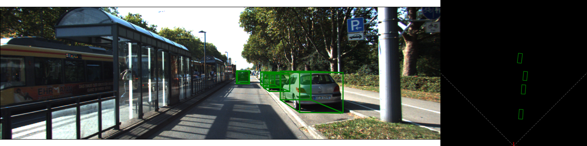
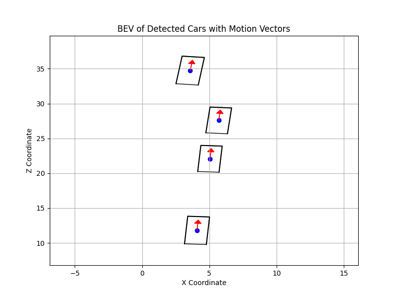
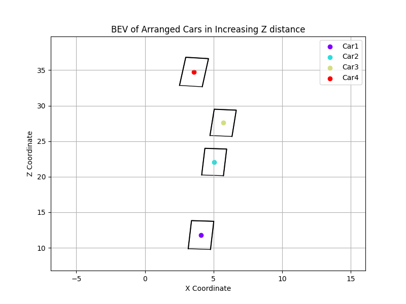
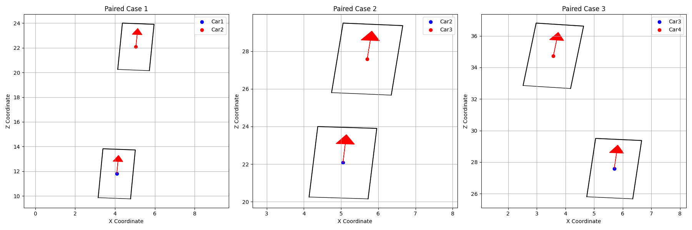
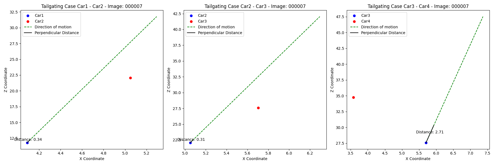
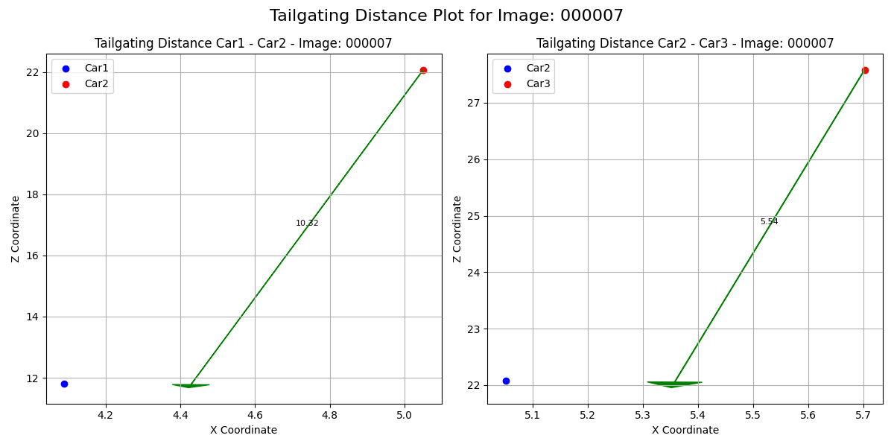

# Automatic Tailgating Detection Pipeline - Tailgating Functions

The contents of this directory involve the process of automatic tailgating using the 3D bounding boxes. Note, the aim
of this pipeline is to calculate the maximum speed difference between two cars, above which tailgating occurs. The two second rule is followed, based on which a car following another vehicle needs to have a distance greater than what it can cover within 2 seconds. This is the threshold used for identifying the maximum velocity difference between two cars.


-----------------------------------------------------------------------------

## Introduction

The code developed for this exercise addresses all images that have been used for network prediction in a specified
directory. Specifically, the predicted labels are taken, and then the same process is applied to each image. Note, some assumptions are made when deploying this code:

1. All cars are moving away from the camera (Z direction). This is implemented artificially by inverting the direction of
motion of cars that do not comply
2. The inference is ran on stationary cars as well, since the images used were not continuous
3. Since there is no access to velocities, the velocity difference between two cars is calculated instead
4. The cars are considered as points, even though their dimensions are available in the form of 3D boxes

The code will apply to all images used for inference, however only one will be visualised (explained in Usage section). Visualisation functions have also been developed to visualise every step of the way. A more detailed analysis of the code follows.

### BEV of Cars

The first part of the `Tailgating_main.py` imports all the predicted labels and all the images, and then for the "chosen_image" a BEV figure is constructed, different to the BEVs produced in the Network section. For image number 7 (000007.png) that was used for testing the code, this can be seen below.





Once the cars and their directions of motion have been identified, the next step is to identify the car in ascending Z order,
meaning from closest car to car furthest away. These are named Car1, Car2... CarN from closest to furthest. For the same image, this can be seen below:



Once the cars have been arranged, pairs of cars need to be established. This is where assumption 1 is comes into play. Since
all cars are assumed to move **away** from the camera (i.e. in increasing Z), the code iterates across all cars and identifies the nearest car in Z direction. In other words, Car1 will be paired with Car2, Car2 will be paired with Car3, and Car3 will be paired with Car4. This is seen in the subfigures generated using the code:



Once the pairs have been established, two filtering methods are applied. Specifically, the rotational filtering and the lane filtering take place. Rotational filtering compares the direction of motion of both cars. A threshold is applied in line 84 of the code. This piece of code finds the smallest angle between the two cars. If this angle exceeds the angular threshold, the cars are assumed to not drive in the same direction, and therefore no tailgating can happen. For example, if a car is turning and another is driving straight, the angle between them exceeds 50 degrees, and therefore no tailgating is considered.

Lane filtering checks the direction of motion of the two cars that are paired. This is done using the direction of motion of the rear car. Subsequently, it is decided if the cars are driving in the same "lane". Specifically, the direction of motion of the rear car is extended, and the normal distance between the front car and the direction of motion of the rear car is calculated. If this distance exceeds the threshold defined in line 87, then the two cars are considered to drive in different lanes, and no tailgating is considered. For example, for the three pairs of cars in the above subfigures, the distances are seen below:




The threshold is set to 1 meter. The first two pairs are below this threshold and therefore are considered to be in the same lane. The final pair (right) has a distance of 2.71 meters, and therefore no tailgating can occur.

Once the pairs have been filtered, the "tailgating_parameters" dictionary is established, which will ultimately describe the conditions of each pair of cars across **all** images.

The final step of the process is to examine the pairs of cars that were not filtered out. In this case, the projection of the front car is created along the direction of motion of the rear car, and the distance between the centres of the two cars is calculated in meters. This is seen below:




This shows that the first pair of cars has a 10.32 meter distance between them, while the second pair has 5.54 meters. Knowing these distances, the 2 second rule is applied. Since the velocities are unknown, the code calculates the maximum velocity difference between these two cars, above which the read car will be considered to tailgate the front car. This is ultimately stored in the tailgating_parameters dictionary, and it is possible to store it as a csv (todo: include image names).


-----------------------------------------------------------------------------
## Usage

1. For any set of images, perform 3D bounding box detection using [SMOKE](https://github.com/lzccccc/SMOKE), as outlined in the network [README](../README.md).

2. Place the inferences (txt files) in a directory ("predictions_dir") and the images in another directory ("images_dir").

3. Access `tailgating_functions/Tailgating_main.py` and edit lines 29 and 30 to the paths in the previous step.

4. (Optional) In the same file edit line 43 to choose which image you want to perform example visualisations.

5. (Optional) In the same file edit line 102 and uncomment lines 102-104 to store a csv in the specified directory which will
show the results of tailgating.

6. Run the following:
```
cd path/to/repo/tailgating_functions
python Tailgating_main.py
```

### Thresholds

As explained in the flowchart, an angular threshold and a lane threshold are apply to filter out car pairs that are incapable of tailgating. These are defined in the `Tailgating_main.py` in line 84 and 87 respectively:

```
tailgate_analysis.filter_by_relative_rotation(angular_threshold=np.pi / 6) (line 84)

tailgate_analysis.filter_tailgating_by_lane(threshold=1)  (line 87)
```

You can edit these directly, note that the lane threshold is in meters.

-----------------------------------------------------------------------------
## Future Work
There were a few things that were not achievable using this setup, and would need further work to be explored. However, including these is beyond the scope of a standard coding exercise. Note that the below points are all possible to implement, but it requires more time.

1. Use the direction of motion instead of Camera Z direction for identifying the closest car
2. Properly save the output in a csv format
3. Visualise the BEV of tailgating cars using colour codes to display low velocity difference
4. Incorporate the 3D bounding box dimensions when examining the distance between cars instead of using their centre points
5. Use the 3D bounding box dimensions to dynamically determine if cars are on the same lane
6. Adjust network to run on non-KITTI data
7. Real-time detection
8. Improved visualisations
